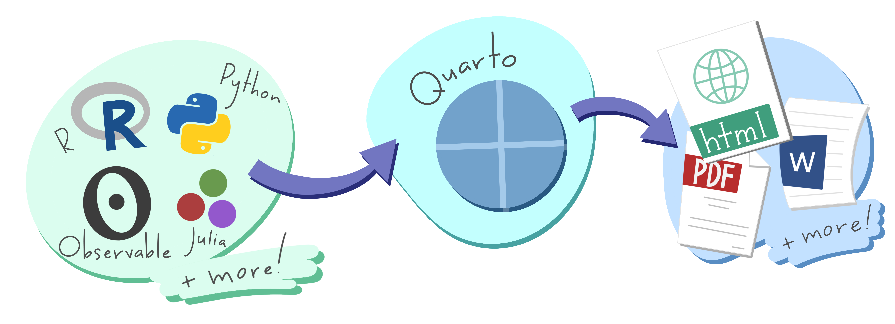

## 🤔 What

- Quarto is an open-source publishing system that allows you to combine text, images, code, plots, and tables in a fully-reproducible document.

- No more copy-paste, no more manually rebuilding analyses from disparate components, no more dread when the data is updated and you need to run an analysis.

## Quarto is a publishing system that supports multiple language and output formats

{fig-alt="A schematic representing the multi-language input (e.g. Python, R, Observable, Julia) and multi-format output (e.g. PDF, html, Word documents, and more) versatility of Quarto." fig-align="center" style="margin-top:-1.5em;margin-bottom:-1em"}  

