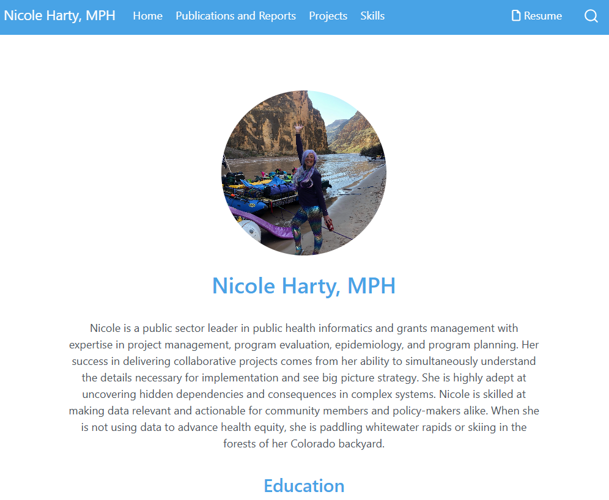
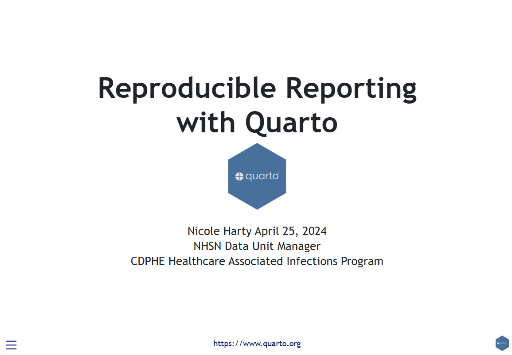
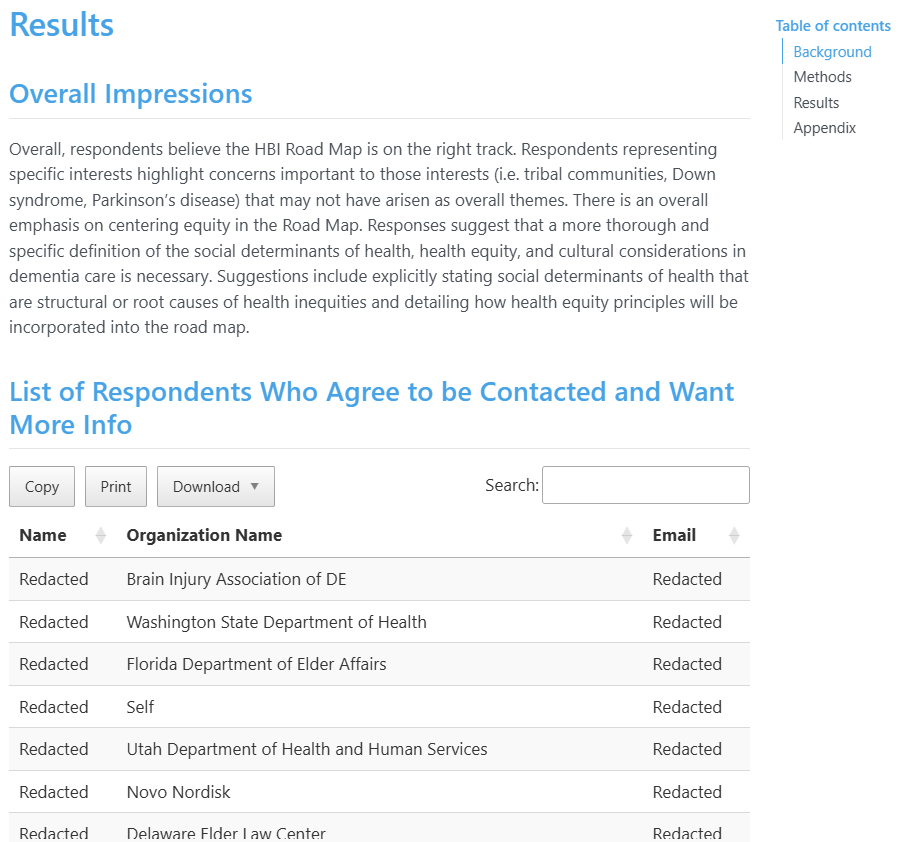
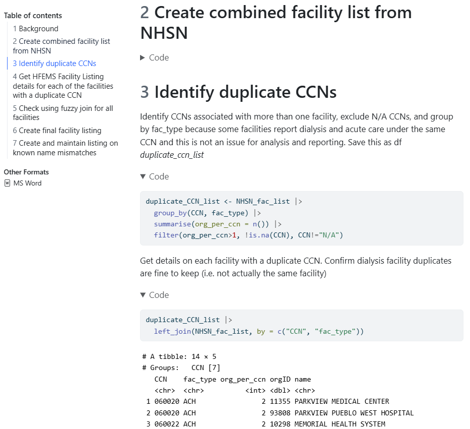
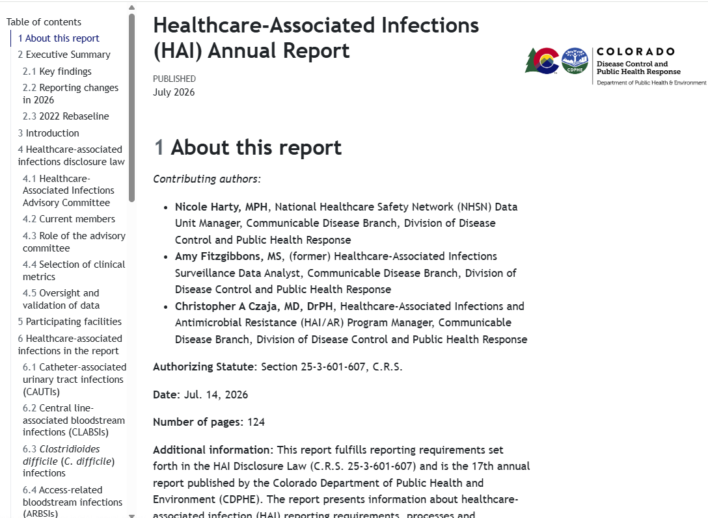

# 🤷 Who?

## You!

- Already work in R or python.  
- Want learn R or python.  
- Work on projects with similarities in analysis or reporting.

## Me!

- Work smarter not harder.  

## We!

- Want to do impactful work without tedious manual work.  
- Want our products to look and feel modern.  
- Must comply with internal review processes and organizational branding.  

## How I Use Quarto  

::: {.r-stack}
{.fragment .fade-in-then-out fig-alt="Screenshot of my personal website built with Quarto" height="120%" width="80%"}

{.fragment .fade-in-then-out fig-alt="Screenshot of workshop slides built with Quarto and revealjs" height="100%" width="70%"}

{.fragment .fade-in-then-out fig-alt="Screenshot of HTML exploratory data analysis report with section headers, floating table f contents, and interactive results table." height="120%" width="80%"}

{.fragment .fade-in-then-out fig-alt="Screenshot of HTML analysis diagnostics report with collapsible code chunks and code output." height="120%" width="80%"}  

{.fragment .fade-in-then-out fig-alt="Screenshot of HTML HAI Annual Report with CDPHE branding, authorship information, and floating table of contents." height="120%" width="80%"}  

:::

