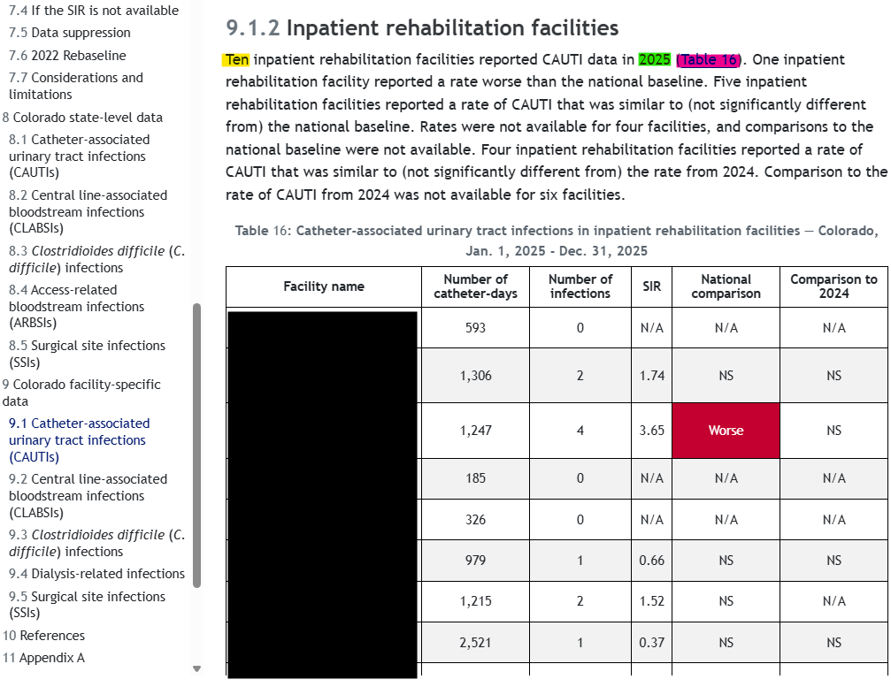
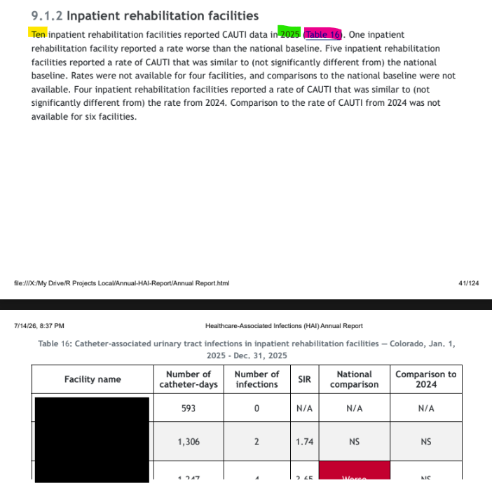
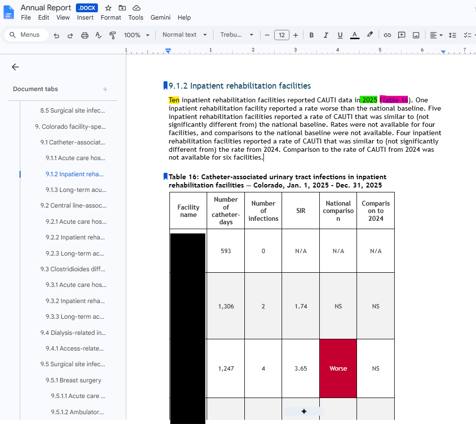
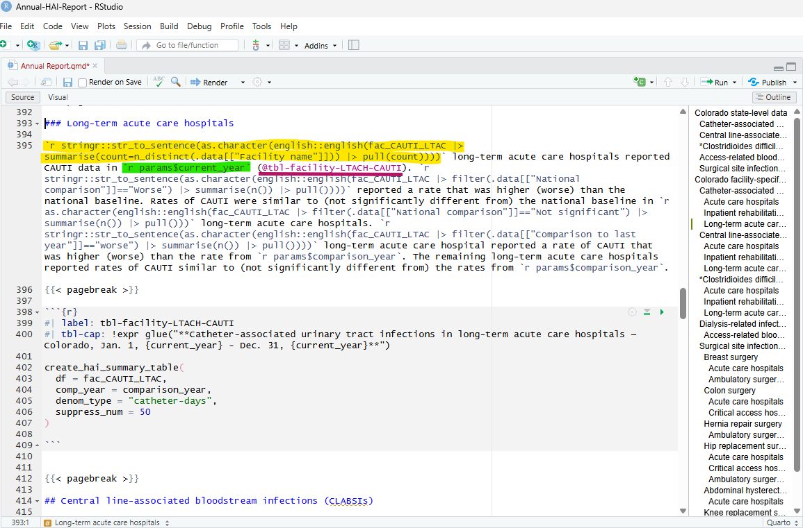

# 🤨 How?  

## 🤨 How?

- [Parameterized reports](https://quarto.org/docs/computations/parameters.html) produce analysis with the click of a button. You could...
  - Show results for a specific geographic location
  - Run a report that covers a specific time period
  - Run a single analysis multiple times for different assumptions
- Repeated values
  - Instead of typing the same information multiple times, use a dynamic variable (aka parameter)
  - Ease maintenance. Reduce the likelihood of an error with your documents
- Calculate numbers within narrative summaries

# 👀 Example 

## HAI Annual Report

Multiple formats of the same report

Extensive use of repeated values, cross-references, calculations within text

- [HTML report](https://cdphe-data.shinyapps.io/HAI-annual-report/)   
- [PDF report](https://drive.google.com/file/d/1g-4HeO24JGY9Bzrs0dyDHWgzHd8MHISE/view) 
- [Google doc](https://docs.google.com/document/d/1zh4qwqhrC_xWoOCSbOB0VffPdNJzN--n/edit?rtpof=true&tab=t.0)   

## HAI Annual Report  

::: {.r-stack}
{.fragment .fade-in-then-out fig-alt="Screenshot of HTML HAI Annual Report with CDPHE branding, authorship information, and floating table of contents." height="120%" width="80%"}

{.fragment .fade-in-then-out fig-alt="Screenshot of PDF HAI Annual Report with CDPHE branding." height="150%" width="100%"}

{.fragment .fade-in-then-out fig-alt="Screenshot of .docx HAI Annual Report with CDPHE branding." height="150%" width="100%"}

:::

## HAI Annual Report

Extensive use of repeated values, cross-references, calculations within text

{fig-alt="Screenshot of .qmd file with markdown and code chunk." height="80%" width="60%"}  
