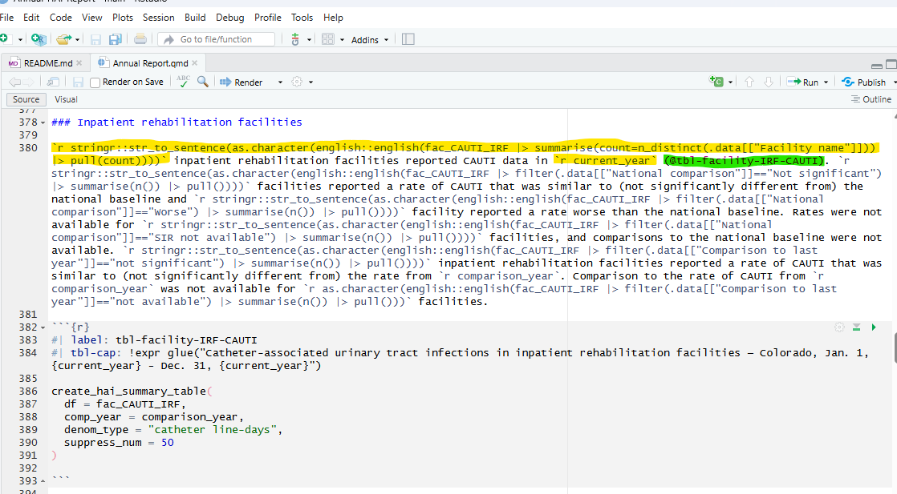
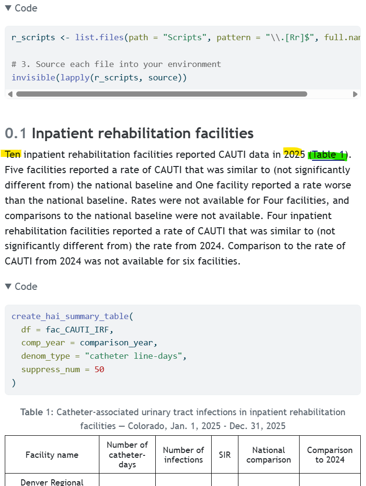
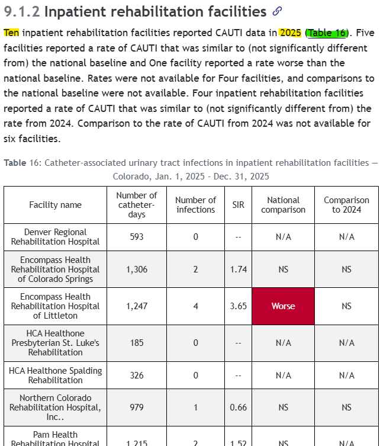
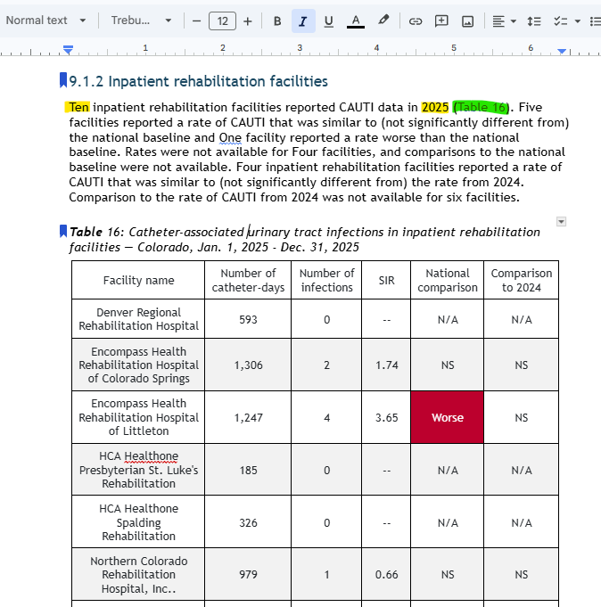

## What  

- Quarto is an open-source publishing system that allows you to combine text, images, code, plots, and tables in a fully-reproducible document.  
  
- No more copy-paste, no more manually rebuilding analyses from disparate components, no more dread when the data is updated and you need to run an analysis.

## Why?  

- Reporting is a necessity. The workflow is often put analysis in a report, cycle through multiple iterations, and finally send it off to stakeholders. And then...  
  - You find an error. Why does that error exist?  
  - You changed a few things last month. Now you want to go back revert one of those changes.  
  - You need to refresh the analysis months later. You need to repeat your original steps **exactly**.  
  

## Why?  

- You write lots of reports with similar structure. You already use a template, but you still do a lot of copy-paste.  

- You don't code much. You don't want a workflow that requires you to write code all the time.  
  
- You use various templates for different types of audiences (i.e. recommendation letter to different facility types, outbreak report for different organisms).  
  
- You want a standard look and feel to your reports but you dislike tedious formatting.  

# Who?     

## You!  
- Already work in R.  
- Want learn R.    
- Work on projects with similarities in analysis or reporting.  

## Me!  
- Work smarter not harder. 


## We!  


- Want to do impactful public health work without tedious manual work.  


- With our powers combined...

  


## How?   

- [Parameterized reports](https://quarto.org/docs/computations/parameters.html) produce analysis with the click of a button. You could... 
  - Show results for a specific geographic location.
  - Run a report that covers a specific time period.
  - Run a single analysis multiple times for different assumptions.  
  
## How?  
- Repeated values  
  - Instead of typing the same information multiple times, use a dynamic variable. 
  - Ease maintenance. Reduce the likelihood of an error with your documents.  
   
- Calculate numbers within narrative summaries    


# Examples   
  
  
 

## AU Feedback Reports  

**Before**: Manual facility specific report updates  
**Future**:  

- Same report template can be run for each facility using only the facility ID.  
- Figures and narrative text update automatically from the data.  
- Comparator groups can be changed, including region, bed size, and facility type.  
- Reports can be rerun quickly when new NHSN data are available.  
- Supports consistent reporting across facilities with less manual editing.  

## HAI Annual Report   

Multiple formats of the same report.  
  
Extensive use of repeated values, cross-references, calculations within text.  

- [HTML report](https://cdphe-data.shinyapps.io/HAI-annual-report/)   
- [Google doc](https://docs.google.com/document/d/1zh4qwqhrC_xWoOCSbOB0VffPdNJzN--n/edit?rtpof=true&tab=t.0)     

## HAI Annual Report  [HTML report](https://cdphe-data.shinyapps.io/HAI-annual-report/)      

:::: {.columns}

::: {.column width="55%"}



:::

::: {.column width="45%"}
  
  
:::

::::

## HAI Annual Report  [HTML report](https://cdphe-data.shinyapps.io/HAI-annual-report/)      

:::: {.columns}

::: {.column width="55%"}


:::

::: {.column width="45%"}
  
  
:::

::::

## HAI Annual Report [Google doc](https://docs.google.com/document/d/1zh4qwqhrC_xWoOCSbOB0VffPdNJzN--n/edit?rtpof=true&tab=t.0)        

:::: {.columns}

::: {.column width="55%"}


:::

::: {.column width="45%"}
  

:::

::::

## Tabsets {.smaller}

::: panel-tabset
### Plot

```{r}
library(ggplot2)
ggplot(mtcars, aes(hp, mpg, color = am)) +
  geom_point() +
  geom_smooth(formula = y ~ x, method = "loess")
```

### Data

```{r}
knitr::kable(mtcars)
```

### Code  
```{r}
#| echo: true
#| eval: false
library(ggplot2)
ggplot(mtcars, aes(hp, mpg, color = am)) +
  geom_point() +
  geom_smooth(formula = y ~ x, method = "loess")

knitr::kable(mtcars)

```

:::

## Now What?  

- Brainstorm use cases for Quarto.  
  - Outbreak reports  
  - Ongoing exploratory analysis  
- Opportunity for NHSN Data Unit to collaborate with EI or P&R?

